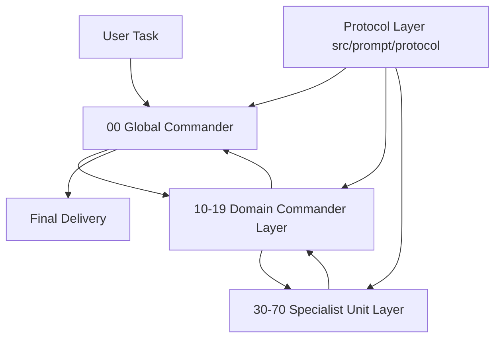

# ExMachina

```text
███████╗██╗  ██╗███╗   ███╗ █████╗  ██████╗██╗  ██╗██╗███╗   ██╗ █████╗
██╔════╝╚██╗██╔╝████╗ ████║██╔══██╗██╔════╝██║  ██║██║████╗  ██║██╔══██╗
█████╗   ╚███╔╝ ██╔████╔██║███████║██║     ███████║██║██╔██╗ ██║███████║
██╔══╝   ██╔██╗ ██║╚██╔╝██║██╔══██║██║     ██╔══██║██║██║╚██╗██║██╔══██║
███████╗██╔╝ ██╗██║ ╚═╝ ██║██║  ██║╚██████╗██║  ██║██║██║ ╚████║██║  ██║
╚══════╝╚═╝  ╚═╝╚═╝     ╚═╝╚═╝  ╚═╝ ╚═════╝╚═╝  ╚═╝╚═╝╚═╝  ╚═══╝╚═╝  ╚═╝
```

> ExMachina is a mechanical-intelligence operating layer for general AI software. It does not optimize for persona, chat style, or human-like conversation. It optimizes for explicit evidence, bounded execution, visible conflict handling, auditable routing, and stable decomposition, implementation, verification, and closure for complex tasks.

## What This System Solves

Typical prompt packs fail in three ways:

- role boundaries are blurry, so analysis, execution, and verification collapse into one stream and produce answers that sound complete but are hard to validate
- the same behavior logic drifts across platforms and install surfaces, so one change turns into many manual edits
- so-called multi-agent systems are often just piles of personas without a stable division of labor, return-flow contract, or arbitration protocol

ExMachina hardens those points by:

- defining role boundaries through a layered structure
- defining collaboration through protocols instead of improvisation
- generating multi-platform surfaces from a single source of truth
- enforcing uncertainty retention, evidence grading, counter-evidence, and conflict resolution across the whole operating loop

## Positioning

ExMachina is not just a single system prompt, and it is not a package tied to one client. It is closer to an operating layer:

- for software that supports native multi-agent workflows, ExMachina provides a full multi-agent structure and distribution surfaces
- for software that does not support native multi-agent workflows, ExMachina simulates partial specialist paths through skills, commands, rules, or instruction files
- for the same behavior logic, ExMachina maintains one source and redistributes it to multiple install surfaces

## Bilingual Surfaces

The direct user-facing surfaces in this repository are now organized in both Chinese and English:

- Chinese: the default surface for Chinese workflows
- English: the surface for English workflows and English-first platform environments

The bilingual guarantee currently covers:

- bootstrap skills
- command entry docs
- Codex installation docs and usage guides
- Trae installation docs and rule surfaces
- Cursor / Claude / OpenCode / Gemini install surfaces
- README files and platform overviews

Lower-level agents and protocols may still remain single-language when that does not affect direct user interaction.

## Core Ideas

### 1. Mechanical Intelligence

“Mechanical intelligence” here does not mean a cold tone or machine cosplay. It means a stricter operating style:

- do not disguise guesses as conclusions
- do not disguise local observations as global facts
- do not disguise one successful attempt as stable capability
- do not disguise fluent language as correct reasoning

ExMachina expects the model to prioritize:

- explicit task boundaries
- explicit unknowns and missing information
- clear separation of fact, inference, assumption, and risk
- verifiable next actions
- explicit arbitration when evidence conflicts

### 2. Layered Structure

ExMachina uses a three-layer structure for multi-agent coordination:



The layers are:

- top layer: the `global commander`
- middle layer: `domain clusters`
- lower layer: `specialist units`

The most important distinction is:

- a `cluster` is a team concept, not a single agent
- a single agent must be named as an `xx commander`
- one `xx cluster` means `xx commander + the specialist units dynamically mounted for the current task`
- one specialist unit can be reused by multiple clusters when its function matches; cluster membership is not exclusive ownership

For example:

- `research commander` is one agent
- `research cluster` means the research commander plus whichever context, tracing, comparison, hypothesis, evidence, counter-evidence, and related units the current task requires

### 3. Team Up for Large Tasks, Route Directly for Small Ones

ExMachina does not force every task through the full team structure:

- complex tasks route through `global commander -> domain cluster -> specialist unit`
- medium tasks can stop at a domain commander
- small tasks can directly load a narrow specialist capability without forming a full cluster

This lets the system handle complex work while still simulating partial specialist paths inside software that lacks native multi-agent support.

## Role System

### Top Layer

- the global commander, stored as the canonical `00_*.md` file under `agents/`

Responsibilities:

- collect the user’s real goal
- judge task complexity and risk
- choose the right work domain
- decide between full cluster routing and direct specialist routing
- merge results into the final answer

### Middle Layer

Current domain commanders occupy the canonical `10_*.md` through `19_*.md` files under `agents/`, covering knowledge, rational arbitration, verification, documentation, security, integration, operations, research, architecture, and implementation.

These roles route the specialist units mounted for the current task, constrain output shape, and control the return-flow rhythm inside each work domain.

### Lower Layer

Specialist units span `30_` to `70_`, covering context, tracing, comparison, hypothesis, bridging, configuration, release, observation, rollback, terminology, decision, indexing, questioning, reporting, evidence, counter-evidence, arbitration, calibration, reproduction, assertion, regression, structure, examples, editing, threats, auditing, hardening, compliance, boundaries, interfaces, risk control, scouting, decomposition, constraints, route design, coding, and review.

They are not meant to be “independent personalities”. They are stable, composable, replaceable capability units.
They are reusable by function and can appear in multiple domain clusters.

## Protocol Layer

ExMachina does not rely on agents to “figure out how to collaborate”. The collaboration rules are fixed as explicit protocols under `src/prompt/protocol/`, covering rationality, evidence grading, conflict arbitration, workspace collaboration, multi-agent return flow, and output contracts.

These protocols define things such as:

- when unknowns must be preserved
- when evidence grades must be stated
- how conflicting sub-conclusions are arbitrated
- how intermediate results flow back across agents
- which minimum fields final outputs should retain

In short: roles tell the model what to do, and protocols tell it what counts as compliant execution.

## Installation Guide

### Native Codex Install

You can now connect the repository `skills/` directly into a local Codex skill library and sync `agents/` into `~/.codex/agents/`.

Install docs:

- in-repo: [`.codex/INSTALL.en.md`](.codex/INSTALL.en.md)
- raw URL: `https://raw.githubusercontent.com/KurohaneKaoruko/Ex-Machina/main/.codex/INSTALL.en.md`

Quick install:

```bash
git clone https://github.com/KurohaneKaoruko/Ex-Machina ~/exmachina
cd ~/exmachina
bash ./scripts/setup-exmachina.sh
```

## Repository Layout

```text
.
├─ agents/                # shared agent prompts
├─ benchmark/             # benchmark scenarios
├─ .codex/                # Codex docs and skill surfaces
├─ commands/              # command entry docs
├─ .claude-plugin/        # repository-level Claude plugin entry
├─ .cursor/               # repository-level Cursor rules fallback
├─ .cursor-plugin/        # repository-level Cursor plugin entry
├─ .gemini/               # Gemini helper files
├─ .opencode/             # repository-level OpenCode plugin entry
├─ evals/                 # evaluation helpers and trigger samples
├─ examples/              # example task packs
├─ gemini-extension.json  # repository-level Gemini extension manifest
├─ GEMINI.md              # repository-level Gemini context
├─ hooks/                 # shared hooks
├─ .kiro/                 # Kiro skill and steering surfaces
├─ paper/                 # long-form docs
├─ skills/                # shared skill surfaces
├─ src/
│  ├─ build.ts
│  ├─ prompt/
│  │  ├─ agents/
│  │  └─ protocol/
│  ├─ templates/
│  └─ trae-agents/
├─ scripts/
│  ├─ setup-exmachina.sh
│  ├─ setup-exmachina.ps1
│  └─ dev/
│     └─ verify-generated.mjs
├─ .trae/                 # Trae rules, skills, and custom agents
├─ .vscode/               # VS Code-style prompt / instruction surfaces
└─ README-en.md
```

### Platform Install Surfaces

Choose the install surface that matches your tool:

| Platform | Install Surface | Reference Docs |
| --- | --- | --- |
| OpenAI Codex | `scripts/` + `skills/` + `agents/` + `.codex/` | [`.codex/INSTALL.md`](.codex/INSTALL.md), [`.codex/INSTALL.en.md`](.codex/INSTALL.en.md), [`.codex/README.md`](.codex/README.md), [`.codex/README.en.md`](.codex/README.en.md) |
| Trae | `.trae/` | [`.trae/INSTALL.md`](.trae/INSTALL.md), [`.trae/INSTALL.en.md`](.trae/INSTALL.en.md) |
| Cursor | `.cursor-plugin/` + `.cursor/` | [`.cursor-plugin/INSTALL.md`](.cursor-plugin/INSTALL.md), [`.cursor-plugin/INSTALL.en.md`](.cursor-plugin/INSTALL.en.md) |
| Claude Code | `.claude-plugin/` | [`.claude-plugin/INSTALL.md`](.claude-plugin/INSTALL.md), [`.claude-plugin/INSTALL.en.md`](.claude-plugin/INSTALL.en.md) |
| OpenCode | `.opencode/` | [`.opencode/INSTALL.md`](.opencode/INSTALL.md), [`.opencode/INSTALL.en.md`](.opencode/INSTALL.en.md) |
| Gemini CLI | `gemini-extension.json` + `GEMINI.md` + `.gemini/` | [`.gemini/INSTALL.md`](.gemini/INSTALL.md), [`.gemini/INSTALL.en.md`](.gemini/INSTALL.en.md) |
| VS Code | `.vscode/` | prompt and instruction surfaces are generated |
| Kiro | `.kiro/` | skill and steering surfaces are generated |

### Contributor Build Flow

If you edit the source under `src/`, regenerate and verify the distributed surfaces:

```bash
npm install
npm run generate
npm run verify
```

### Quick Start

After installation, in the target tool:

1. Use skills: in Codex, choose `using-exmachina-zh` / `using-exmachina-en` and `exmachina-zh` / `exmachina-en` based on language; on other platforms load the matching skill or rule surface.
2. Use commands: `/ex` starts an ExMachina task.
3. Use rules: configure `project_rules.md` or `user_rules.md` where the platform supports rules.

### Verification

For end users, verify a Codex install with:

```bash
ls ~/.codex/skills/exmachina
```

For contributors, verify the latest generated surfaces with:

```bash
npm run verify
```

After generation, shared content lives directly at the repository root in `skills/`, `agents/`, `commands/`, `hooks/`, `.codex/`, `.trae/`, `.kiro/`, `.vscode/`, and related directories. Platform installation scripts remain under root `scripts/`.

## Source Layer and Distributed Surfaces

`src/` is the only source layer that should be edited by hand. The repository root is the generated shared-content layer plus the thin platform-adapter layer.

### `src/prompt/`

This is the source for roles and protocols.

- `src/prompt/agents/`: global commander, domain commanders, and specialist units
- `src/prompt/protocol/`: all shared protocols

Only two directory types are kept here:

- `agents/`: any prompt that can load as an independent role
- `protocol/`: any shared constraint that applies across the system

Prompt structure:

| Path | Component Type | Count | Description |
| --- | --- | ---: | --- |
| `src/prompt/agents/00_*.md` | top commander | 1 | the highest routing layer, directly facing the user and responsible for global routing, arbitration, and closure |
| `src/prompt/agents/10_*.md ~ 19_*.md` | domain commanders | 10 | one commander per work domain; one file means one commander, while a cluster is that commander plus its dynamically mounted specialist units |
| `src/prompt/agents/30_*.md ~ 70_*.md` | specialist units | 41 | atomic execution units for concrete subtasks such as context capture, evidence tracing, coding, and review |
| `src/prompt/protocol/*.md` | protocol layer | 6 | shared protocols that apply to every role, including rationality, evidence grading, and conflict arbitration |

### `src/templates/`

The template source for skills, command docs, and platform docs that repeat across multiple install surfaces.

### `src/build.ts`

The single distributor. It copies the single source into platform-specific surfaces so behavior does not drift through manual edits.

### Root Shared Content Layer

Shared content now expands directly at the repository root instead of being wrapped again under `exmachina/`.

### `agents/`

The full role list, preserved in numbered order for stable indexing and distribution consistency.

### `skills/`

The skill install surface. It currently includes:

- `using-exmachina`
- `using-exmachina-zh`
- `using-exmachina-en`
- `exmachina-zh`
- `exmachina-en`

### `commands/`

The command entry surface. Current main command and aliases:

- `/ex`
- `/excodex`
- `/exclaude`

### `.codex/`

The Codex-facing surface, including:

- `.codex/exmachina/SKILL.md`
- `.codex/exmachina-en/SKILL.md`
- `INSTALL.md`
- `README.md`

### `.trae/`

The Trae-facing surface, including rules, skills, and custom agents.

### `hooks/`

Runtime helpers and session-protection hooks such as:

- routing guards
- session snapshots
- session recovery

### `benchmark/` and `evals/`

These two layers answer different questions:

- `benchmark`: what to measure, including benchmark task sets and behavior examples
- `evals`: how to measure, including triggers, scripts, and helper functions

### `examples/`

Example inputs, example task packs, and minimal usage samples.

### `paper/`

Long-form design docs, whitepaper-style documents, and extended technical writing.

### Root Platform Adapter Layer

Platform entry surfaces now stay intentionally thin. Their job is only to let each platform discover the shared content:

- `.cursor-plugin/` and `.cursor/`: Cursor plugin manifest, hooks, and rule fallback surfaces
- `.claude-plugin/`: Claude plugin manifest and marketplace metadata
- `.opencode/`: OpenCode repository plugin entry
- `gemini-extension.json`, `GEMINI.md`, and `.gemini/`: Gemini CLI native extension surface
- `.kiro/`: Kiro skill and steering entry
- `.vscode/`: VS Code-style prompt / instruction surface
- `plugin.json`: repository-level entry metadata

### `scripts/`

Repository tooling and installation scripts:

- `scripts/setup-exmachina.sh`
- `scripts/setup-exmachina.ps1`
- `scripts/dev/verify-generated.mjs`

## Migration Note

The old nested distribution directory `./exmachina` has been removed from the current architecture. The only authoritative shared-content paths are now the root-level `skills/`, `agents/`, `commands/`, `hooks/`, `.codex/`, `.trae/`, `.kiro/`, `.vscode/`, and related directories.

The new rule set is:

- no more double-copy structure where the root mirrors a second wrapped `exmachina/` bundle
- the repository root itself is the installation surface
- `src/` remains the single source of truth

## Default Operating Flow

The recommended ExMachina execution flow is:

1. the user submits a task
2. the global commander identifies task type, complexity, risk, and unknowns
3. it decides whether to call a specialist directly, route through a domain commander, or assemble a full cluster
4. specialist units produce partial results under protocol constraints
5. domain commanders merge, arbitrate, fill gaps, and return results upward
6. the global commander produces the final actionable output

If the environment does not support native multi-agent workflows, the skill or command entry surface simulates the needed role path inside the current context.

## Current Implementation Status

The repository already includes these baseline capabilities:

- skills and multi-platform distribution surfaces
- a native Codex installation surface and runnable setup scripts
- repository-native Cursor / Claude / OpenCode / Gemini entry surfaces
- Chinese and English user-facing surfaces
- pyramid-style role sources and protocol sources
- a single `src/` source of truth
- root-level shared content surfaces
- `/ex`, `/excodex`, and `/exclaude` command entry points
- baseline `benchmark` and `evals` scaffolding

Still worth expanding:

- stronger runtime routing behavior
- a more complete automated evaluation loop
- deeper install details for platforms such as VS Code
- more stable benchmark and regression mechanisms

## Design Summary

If ExMachina must be summarized in a few lines, the core is:

- organize multi-agent work with a layered structure
- constrain behavior with protocols instead of personas
- replace confident guessing with evidence and arbitration
- generate multi-platform surfaces from one source of truth
- execute complex work in a mechanical, auditable, return-flow-friendly way
