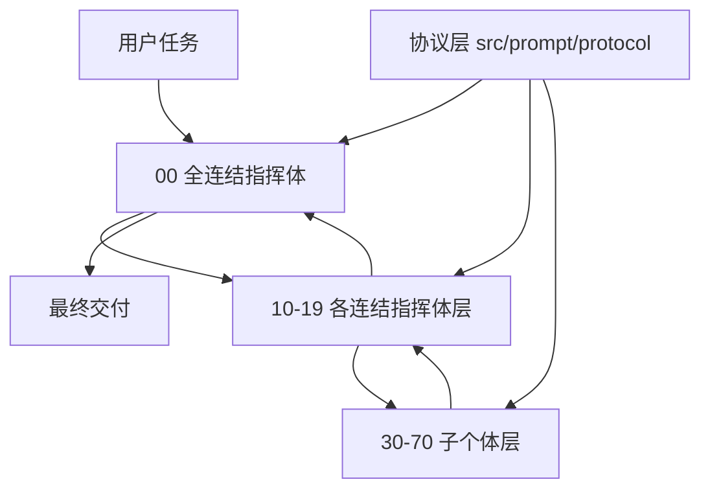

# ExMachina

```text
███████╗██╗  ██╗███╗   ███╗ █████╗  ██████╗██╗  ██╗██╗███╗   ██╗ █████╗
██╔════╝╚██╗██╔╝████╗ ████║██╔══██╗██╔════╝██║  ██║██║████╗  ██║██╔══██╗
█████╗   ╚███╔╝ ██╔████╔██║███████║██║     ███████║██║██╔██╗ ██║███████║
██╔══╝   ██╔██╗ ██║╚██╔╝██║██╔══██║██║     ██╔══██║██║██║╚██╗██║██╔══██║
███████╗██╔╝ ██╗██║ ╚═╝ ██║██║  ██║╚██████╗██║  ██║██║██║ ╚████║██║  ██║
╚══════╝╚═╝  ╚═╝╚═╝     ╚═╝╚═╝  ╚═╝ ╚═════╝╚═╝  ╚═╝╚═╝╚═╝  ╚═══╝╚═╝  ╚═╝
```

> ExMachina 是一套面向通用 AI 软件的机械智能操作层。它不追求人格化、不追求“像人类一样聊天”，而是追求绝对理性、证据驱动、冲突显式化、路径可审计，以及在复杂任务中稳定地拆解、执行、校验和收束。

## 这套系统解决什么问题

普通提示词系统常见的问题有三类：

- 角色边界模糊：分析、执行、校验混在一起，模型容易边想边编，最后输出看似完整但无法验证。
- 提示词重复分叉：同一段逻辑散落在多个平台、多种安装面里，后续一改就漂移。
- 多智能体协作失真：表面上有“很多智能体”，本质上只是堆很多身份，没有稳定的分工协议、回流协议和冲突裁决机制。

ExMachina 的目标就是把这三件事做硬：

- 用多层结构定义角色边界。
- 用协议定义协作方式，而不是让角色自由发挥。
- 用单一真相源生成多平台产物，避免多处手改。
- 用“未知保留、证据分级、反证优先、冲突裁决”约束整个系统。

## 系统定位

ExMachina 不是单一模型的一段系统提示词，也不是只服务某一个客户端的软件包。它更接近一层中间操作层：

- 对支持多智能体协作的软件，ExMachina 提供完整的多智能体结构与分发产物。
- 对不支持多智能体的软件，ExMachina 通过 Skill、命令、规则或指令文件模拟局部子个体或局部链路。
- 对同一套行为逻辑，ExMachina 只维护一套源，再复制分发到不同安装面。

## 双语版本

现在仓库中的用户直接交互面已按中英文两套版本组织：

- 中文面：默认入口，适合中文工作流
- 英文面：适合英文工作流与跨平台英文环境

优先保证双语的部分包括：

- Skill 入口
- 命令入口说明
- Codex 安装文档与使用说明
- Trae 安装文档与规则面
- Cursor / Claude / OpenCode / Gemini 的安装面
- README 与平台说明

底层 agents / protocol 仍允许单语维护，不强制所有内部提示词都做双语镜像。

## 核心理念

### 1. 机械智能

这里的“机械智能”不是冷酷语气，也不是故意写得像机器，而是指一套更严格的工作方式：

- 不把猜测伪装成结论。
- 不把局部观察伪装成全局事实。
- 不把单次成功伪装成稳定能力。
- 不把语言流畅伪装成推理正确。

ExMachina 要求模型优先做这些事：

- 明确任务边界
- 识别未知与缺口
- 区分事实、推断、假设、风险
- 输出可校验的下一步
- 在冲突信息出现时显式裁决

### 2. 多层结构

ExMachina 使用三层结构组织多智能体协作：



这三层分别是：

- 顶层：`全连结指挥体`
- 中层：`各工作域连结体`
- 底层：`子个体`

其中最容易混淆的一点是：

- `连结体` 是团队概念，不是单个智能体。
- 单个智能体必须写成 `xx连结指挥体`。
- 一个 `xx连结体` 由 `xx连结指挥体 + 按任务动态挂载的子个体集合` 组成。
- 同一个子个体可以按职能被多个连结体复用，不存在强制的一对一归属。

例如：

- `研究连结指挥体` 是单个智能体。
- `研究连结体` 则表示“研究连结指挥体 + 当前任务需要挂载的上下文体 / 溯源体 / 比对体 / 假设体 / 证据体 / 反证体等单元”这一整支团队。

### 3. 大任务组队，小任务直达

ExMachina 不是强制每个任务都走完整团队模式：

- 复杂任务由 `全连结指挥体 -> 某连结体 -> 子个体` 逐层分派。
- 中等任务可以直接交给某个 `xx连结指挥体` 完成。
- 小任务可以直接临时加载某个子个体能力，而不需要完整组建连结体。

这让系统既能处理复杂任务，也能在不支持原生多智能体的软件里通过 Skill 模拟局部能力。

## 角色体系

### 顶层角色

- `00_全连结指挥体`

职责：

- 收拢用户真实目标
- 判断任务复杂度与风险
- 选择合适的工作域
- 决定是走连结体协作还是直接调用子个体
- 汇总结果并形成最终输出

### 中层角色

当前工作域连结指挥体包括：

- `10_知识连结指挥体`
- `11_理性连结指挥体`
- `12_校验连结指挥体`
- `13_文档连结指挥体`
- `14_安全连结指挥体`
- `15_集成连结指挥体`
- `16_运维连结指挥体`
- `17_研究连结指挥体`
- `18_架构连结指挥体`
- `19_实作连结指挥体`

这些角色负责在各自工作域内调度子个体、约束输出形态、控制回流节奏。

### 底层角色

子个体从 `30_` 到 `70_` 编号，覆盖上下文、溯源、比对、假设、接驳、配置、发布、观测、回滚、术语、决策、索引、问题、汇报、证据、反证、裁决、校准、复现、断言、回归、结构、示例、校订、威胁、审计、加固、合规、边界、接口、风控、侦察、拆解、约束、路线、编码、审核等细分能力。

它们的定位不是“独立人格”，而是稳定、可组合、可替换的功能单元。
它们按职责复用，可以同时出现在多个连结体的常用挂载清单中。

## 协议层

ExMachina 不依赖“角色自己发挥协作意识”，而是把协作规范固定成显式协议。当前协议源位于 `src/prompt/protocol/`：

- `01_绝对理性协议`
- `02_证据分级协议`
- `03_冲突裁决协议`
- `04_工作区与协作协议`
- `05_多智能体回流协议`
- `06_输出契约`

这些协议约束的重点包括：

- 什么时候必须保留未知
- 什么时候必须给出证据等级
- 多个子结论冲突时如何裁决
- 多个智能体之间如何回流中间结果
- 最终输出应保留哪些最小字段

可以把它理解成：角色告诉模型“做什么”，协议告诉模型“怎么做才算合规”。

## 仓库结构

当前仓库采用"根目录共享内容 + 根目录平台适配层 + `src/` 单一源码层"结构：

```text
.
├─ agents/                # 共享角色提示词
├─ benchmark/             # 基准场景
├─ .codex/                # Codex 文档与技能使用面
├─ commands/              # 命令入口文档
├─ .claude-plugin/        # 仓库级 Claude 插件入口
├─ .cursor/               # 仓库级 Cursor 规则回退面
├─ .cursor-plugin/        # 仓库级 Cursor 插件入口
├─ .gemini/               # Gemini 辅助文件
├─ .opencode/             # 仓库级 OpenCode 插件入口
├─ evals/                 # 评测辅助与触发样本
├─ examples/              # 示例任务包
├─ gemini-extension.json  # 仓库级 Gemini extension manifest
├─ GEMINI.md              # 仓库级 Gemini context
├─ hooks/                 # 共享 hooks
├─ .kiro/                 # Kiro 技能与 steering 面
├─ paper/                 # 长文档说明
├─ skills/                # 共享技能面
├─ src/
│  ├─ build.ts
│  ├─ prompt/
│  │  ├─ agents/
│  │  └─ protocol/
│  ├─ templates/
│  └─ trae-agents/
├─ scripts/
│  ├─ setup-exmachina.sh
│  ├─ setup-exmachina.ps1
│  └─ dev/
│     └─ verify-generated.mjs
├─ .trae/                 # Trae 规则、技能与自定义 agents
├─ .vscode/               # VS Code 风格 prompt / instructions 面
└─ README.md
```

## 安装指南

### Codex 原生安装

现在可以直接把仓库的 `skills/` 接入本地 Codex 技能库，并把 `agents/` 同步到 `~/.codex/agents/`。

安装文档：

- 仓库内：[`.codex/INSTALL.md`](.codex/INSTALL.md)
- Raw URL：`https://raw.githubusercontent.com/KurohaneKaoruko/Ex-Machina/main/.codex/INSTALL.md`

快速安装：

```bash
git clone https://github.com/KurohaneKaoruko/Ex-Machina ~/exmachina
cd ~/exmachina
bash ./scripts/setup-exmachina.sh
```

### 平台安装

根据你使用的 IDE 或工具，选择对应的安装方式：

| 平台 | 安装文件位置 | 参考文档 |
|------|-------------|---------|
| OpenAI Codex | `scripts/` + `skills/` + `agents/` + `.codex/` | [`.codex/INSTALL.md`](.codex/INSTALL.md), [`.codex/INSTALL.en.md`](.codex/INSTALL.en.md), [`.codex/README.md`](.codex/README.md), [`.codex/README.en.md`](.codex/README.en.md) |
| Trae | `.trae/` | [`.trae/INSTALL.md`](.trae/INSTALL.md), [`.trae/INSTALL.en.md`](.trae/INSTALL.en.md) |
| Cursor | `.cursor-plugin/` + `.cursor/` | [`.cursor-plugin/INSTALL.md`](.cursor-plugin/INSTALL.md), [`.cursor-plugin/INSTALL.en.md`](.cursor-plugin/INSTALL.en.md) |
| Claude Code | `.claude-plugin/` | [`.claude-plugin/INSTALL.md`](.claude-plugin/INSTALL.md), [`.claude-plugin/INSTALL.en.md`](.claude-plugin/INSTALL.en.md) |
| OpenCode | `.opencode/` | [`.opencode/INSTALL.md`](.opencode/INSTALL.md), [`.opencode/INSTALL.en.md`](.opencode/INSTALL.en.md) |
| Gemini CLI | `gemini-extension.json` + `GEMINI.md` + `.gemini/` | [`.gemini/INSTALL.md`](.gemini/INSTALL.md), [`.gemini/INSTALL.en.md`](.gemini/INSTALL.en.md) |
| VS Code | `.vscode/` | Prompt 与 instructions 产物已生成 |
| Kiro | `.kiro/` | Skill 与 steering 产物已生成 |

### 贡献者构建产物

如果你在修改 `src/` 下的源码，需要重新生成全部产物：

```bash
npm install
npm run generate
npm run verify
```

### 快速开始

安装完成后，在对应工具中：

1. **使用 Skill**：Codex 可按语言选择 `using-exmachina-zh` / `using-exmachina-en` 与 `exmachina-zh` / `exmachina-en`；其他平台加载对应语言的 skill 或规则文件
2. **使用命令**：`/ex` 启动 ExMachina 任务
3. **使用规则**：在 Rules 中配置 `project_rules.md` 或 `user_rules.md`

### 验证安装

普通使用者验证 Codex 安装：

```bash
ls ~/.codex/skills/exmachina
```

贡献者验证最新生成产物：

```bash
npm run verify
```

生成成功后，共享内容直接位于仓库根目录的 `skills/`、`agents/`、`commands/`、`hooks/`、`.codex/`、`.trae/`、`.kiro/`、`.vscode/` 等目录；平台安装脚本仍位于根目录 `scripts/`。

## 源码层与产物层

`src/` 是唯一源码层，负责维护真正需要人工编辑的内容；根目录则是生成后的共享内容层与平台适配层。

#### `src/prompt/`

角色与协议源。

- `src/prompt/agents/`：全连结指挥体、各连结指挥体、子个体
- `src/prompt/protocol/`：所有共享协议

这里固定只保留两类目录：

- `agents/`：凡是可以作为独立角色加载的提示词，都统一放这里，不再额外拆 `groups/`
- `protocol/`：凡是对整个系统生效的共享约束，都统一放这里

提示词文件结构如下：

| 目录路径 | 组件类型 | 数量 | 说明 |
| --- | --- | ---: | --- |
| `src/prompt/agents/00_全连结指挥体.md` | 顶层指挥体 | 1 | 系统最高调度层，直接面对用户，负责总路由、总裁决、总收束。 |
| `src/prompt/agents/10_*.md ~ 19_*.md` | 连结指挥体 | 10 | 各工作域的指挥智能体，例如 `17_研究连结指挥体.md`、`19_实作连结指挥体.md`。单个文件表示单个指挥体，不表示整个连结体。 |
| `src/prompt/agents/30_*.md ~ 70_*.md` | 子个体 | 41 | 负责具体子任务的原子执行单元，例如 `30_上下文体.md`、`45_证据体.md`、`69_编码体.md`、`70_审核体.md`。 |
| `src/prompt/protocol/*.md` | 协议层 | 6 | 对所有角色生效的共享协议，例如 `01_绝对理性协议.md`、`02_证据分级协议.md`、`03_冲突裁决协议.md`。 |

#### `src/templates/`

跨多个安装面重复出现的主 Skill、命令模板和平台说明模板。

#### `src/build.ts`

唯一分发器。它负责把单一源复制到不同产品目录中，避免多处手改。

### 根目录共享内容层

共享内容现在直接展开在仓库根目录，而不是再包一层 `exmachina/`。

### `agents/`

完整的角色清单，按编号顺序保存。这里保留文件名前缀序号，用于维持稳定索引与分发一致性。

### `skills/`

Skill 安装面。当前包含：

- `using-exmachina`
- `using-exmachina-zh`
- `using-exmachina-en`
- `exmachina-zh`
- `exmachina-en`

### `commands/`

命令入口。当前主命令和别名为：

- `/ex`
- `/excodex`
- `/exclaude`

这些命令用于把 ExMachina 作为可调用工作流接入不同环境。

### `.codex/`

Codex 使用面，包含：

- `.codex/exmachina/SKILL.md`
- `.codex/exmachina-en/SKILL.md`
- `INSTALL.md`
- `README.md`

### `.trae/`

Trae 使用面，包含规则、技能与自定义 agents。

### `hooks/`

运行辅助钩子与会话保护脚本，例如：

- 路由守卫
- 会话快照
- 会话恢复

### `evals/`

评测执行层。它更偏向“怎么测”，通常放触发器、测试脚本、辅助函数。

### `benchmark/`

基准场景层。它更偏向“测什么”，通常放固定任务样本、基准数据和行为样例。

可以简单理解为：

- `benchmark`：题库
- `evals`：判题与执行流程

### `examples/`

示例输入、示例任务包或最小调用样例。

### `paper/`

面向设计说明、白皮书或更长篇技术论述的文档面。

### 根目录平台适配层

各平台安装入口现在都尽量保持“薄壳”设计，只负责让平台发现共享内容：

- `.cursor-plugin/` 与 `.cursor/`：Cursor 插件 manifest、hooks 与规则回退面
- `.claude-plugin/`：Claude 插件 manifest 与 marketplace 描述
- `.opencode/`：OpenCode 仓库插件入口
- `gemini-extension.json`、`GEMINI.md` 与 `.gemini/`：Gemini CLI 原生 extension 面
- `.kiro/`：Kiro Skill 与 steering 入口
- `.vscode/`：VS Code 风格 prompt / instructions 面
- `plugin.json`：仓库级入口元数据

### `scripts/`

仓库工具与安装脚本目录。当前按职责分层：

- `scripts/setup-exmachina.sh`
- `scripts/setup-exmachina.ps1`
- `scripts/dev/verify-generated.mjs`

## 迁移说明

旧的嵌套产物目录 `./exmachina` 已从当前架构中移除。现在唯一有效的共享内容路径就是根目录下的 `skills/`、`agents/`、`commands/`、`hooks/`、`.codex/`、`.trae/`、`.kiro/`、`.vscode/` 等目录。

这次收束后的原则是：

- 不再保留“根目录一份 + `exmachina/` 再包一份”的双层复制结构
- 根目录直接作为仓库级安装面
- `src/` 继续作为单一真相源

## 默认工作方式

ExMachina 的推荐执行流程大致如下：

1. 用户提出任务。
2. `全连结指挥体` 识别任务类型、复杂度、风险与未知。
3. 选择直接调用子个体、直接调用某个连结指挥体，或组建完整连结体。
4. 各子个体在协议约束下产出局部结果。
5. 连结指挥体整合、裁决、补缺、回流。
6. 全连结指挥体给出最终可执行结果。

如果环境不支持原生多智能体，则由 Skill 或命令入口在当前上下文中暂时模拟对应角色链路。


## 当前实现状态

当前仓库已经具备这些基础能力：

- Skill 与多平台分发表面
- Codex 原生安装面与可执行安装脚本
- Cursor / Claude / OpenCode / Gemini 的仓库级安装入口
- 中英文双版本的用户交互面
- 金字塔角色源与协议源
- `src/` 单一真相源
- 根目录共享内容层
- `/ex`、`/excodex`、`/exclaude` 命令入口
- `benchmark` 与 `evals` 的基础骨架

仍在持续完善的部分主要是：

- 更强的运行时路由能力
- 更完整的自动评测回路
- VS Code 等平台的安装细节继续细化
- 更稳定的场景基准与回归机制

## 设计原则总结

如果只用几句话概括 ExMachina，它的核心就是：

- 用多层结构组织多智能体
- 用协议而不是人格来约束行为
- 用证据与裁决替代“自信输出”
- 用单一真相源生成多平台产物
- 用机械化、可审计、可回流的方式执行复杂任务
